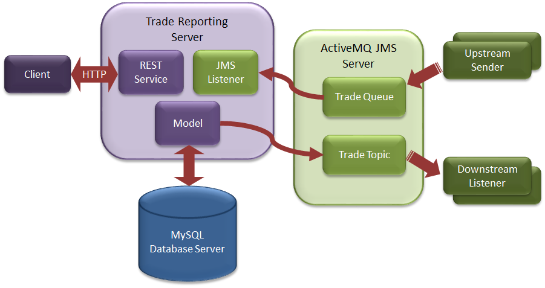
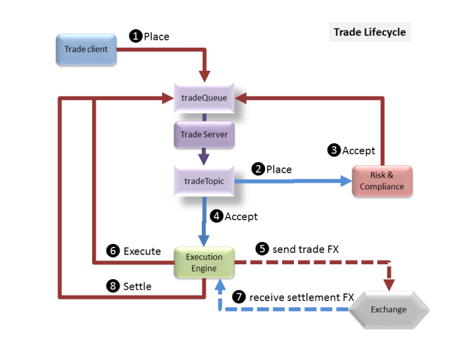
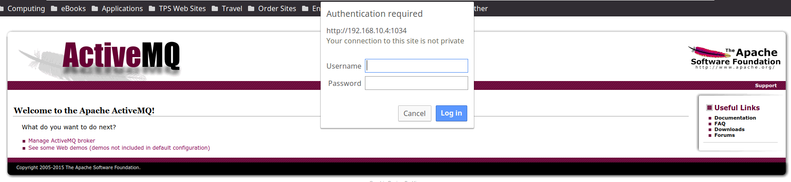
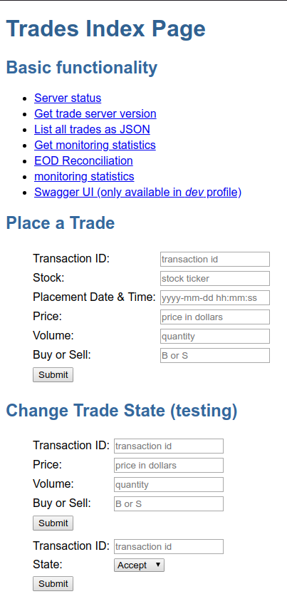

# The Application

The application developer has created the following documentation about the system;

## Application Overview

A simple Trade Reporting Application is provided as the basis for building a more functional Trading System. The overall architecture of the system is shown below:

 

### Trade Reporting Server

The sample application is used to record the current state of intra-day trades: all trades are cleared from the system as part of End-Of-Day reconciliation. The application is a simplified representation of a stage in a multi-stage trade processing system.

**Trade Overview**

A trade is a Buy or Sell of a Stock and records the trade **Price** (in dollars) and the **Volume** of the trade. A trade has a unique **Transaction ID** and a placement **Date & Time**. Trades follow a defined lifecycle managed by other applications within the trading system:

Place - a trade has been placed into the system but not yet processed

Modify - the initial trade details have been amended and multiple updates are allowed - only Placed or Modified trades can be modified

- Accept - the trade has passed risk and compliance requirements and is waiting execution
- Deny - the trade has not passed risk and compliance
- Cancel - the trade was cancelled – only Placed, Modified or Accepted trades can be cancelled
- Execute - the trade has been sent to the exchange
- Settle - the trade has been confirmed by the exchange as completed
- Reject - the trade has been rejected by the exchange

The reporting system records the current trade Status and the time & date the status was last changed: no historical record of trade state changes is kept.

**Trade Lifecycle**

A successful trade starting from a trading client (Trader desktop app or automated trading engine) is placed into the system. The execution engine receives the placed trade, verifies it meeets all trading risk and compliance requirements and sends an accept authorisation to the system. The execution engine receives the accept message and sends the trade to the appropriate external exchange (FTSE, NYSE, ...) and sends an internal execute message to te system. When the external exchange sends back the settlement details the execution engine sends a final settled message to the system.

 

Alternate decision points:

Risk & Compliance sends a deny message if the trade is not allowed

Execution Engine receives a rejected response from the external exchange and sends a reject trade message

A completed trade can be in one of the following end states: settle, deny or reject.

Note that the Risk & Compliance may involve manual (or automated intervention) with feedback to the trader to allow a trade to be modified so it can meet compliance requirements. A modified trade message will follow the same compliance assessment as a placed message. Once a message has been accepted (or denied) it can no longer be modified.

### Run Trade Server

The application is installed into /opt/trade-app directory.

It is started with;
```
service trade-app start
```

You can also **stop** and **restart** the application.

**MySQL Database**

The application talks to an external MySQL database that is called **mysql.server** which you can log on to with the following credentials;

- Username: **root**, Password: **my-secret-pw**
- Username: **trades, Password: **trades**, Database: **trades**

**Note:** The application user is called **trades** and can only access the **trades** database.

**ActiveMQ**

An ActiveMQ messaging system is also used by the system and this can be accessed by connecting to its management URL, which will be defined when you start the test, but looks something like;

- [http://localhost:8161/admin](http://localhost:8161/admin)
  - Where localhost will be the address of your server, and 8161 will be the port you are told.

From the application server it is called **activemq.server**.  The log in for ActiveMQ is;

- Username: admin,  Password: admin

The server requires 2 queues;

- tradeQueue a queue for sending upstream messages to the server
- tradeTopic a durable topic for sending downstream activity notifications

Messages are put on the queue and topic as TextMessages with the object data encoded as JSON (to avoid Serialization). Each message is also tagged with an Operation property which is used as a select filter on the queue listener methods. Properties are:

- Add add new trade - JSON trade in message
- Update add new trade - JSON trade in message
- Cancel cancel trade - JSON trade transaction ID in message
- Accept accept trade - JSON trade transaction ID in message
- Deny accept trade - JSON trade transaction ID in message
- Execute execute trade - JSON trade transaction ID in message
- Settle settle trade - JSON trade transaction ID in message
- Reject reject trade - JSON trade transaction ID in message

**The Application Server**

To run the server from the command line to use (this is one line):
```
cd /opt/trade-app

java -Dspring.config.location=target/application.properties,application.properties -Dcom.sun.management.jmxremote -Dcom.sun.management.jmxremote.port=9990 -Dcom.sun.management.jmxremote.authenticate=false -Dcom.sun.management.jmxremote.ssl=false -jar target/trade-app-0.1.0.jar >/var/log/trade-app/server.stdout 2>/var/log/trade-app/server.stderr &
```
The server will also need an injector running;
```
cd /opt/trade-app

/usr/bin/java -cp target/trade-app-0.1.0.jar -Dspring.config.location=target/application-injector.properties,application-injector.properties -Dloader.main=com.neueda.trade.injector.Injector org.springframework.boot.loader.PropertiesLauncher >/var/log/trade-app/injector.stdout 2>/var/log/trade-app/injector.stderr
```
**Note:** Check the version number against the POM to ensure you are using the correct JAR file.

Once running you can browse to to see the GUI interface:

- [http://localhost:8080](http://localhost:8080)

**Note:** All log files for the application are located in /var/log/trade-app directory, except the trade-record logs which is called **/opt/trade-app/target/trade-record.log**

The log files;
* /opt/trade-app/target/trade-record.log
* /var/log/trade-app/server.stdout
* /var/log/trade-app/server.stderr
* /var/log/trade-app/injector.stdout
* /var/log/trade-app/injector.stderr

The index page has a few simple links to show functionality and forms for adding/modifying trades. At the bottom of the index page is a link to an Angular JS GUI which can also be used to add/modify trades and change trade states (accept, execute, settle, ...).

In production mode the server displays INFO log messages so you can see activity. Change the **com.neueda.trade** property in the **application-prod.properties** file to WARN to show warning messages or higher on the console. All messages are also logged to the file **trade-record.log** in the startup directory.

### Useful Information

**Application URLs**

- Trading statistics
  - http://localhost:8080/trades/stats
  - Output;
```
      {"totalTrades":2,"activeTrades":2,"placedTrades":2,"cancelledTrades":0,"deniedTrades":0,"rejectedTrades":0,"settledTrades":0}
```
- List trades
  - http://localhost:8080/trades/list
  - Output;
```
      [{"id":1,"transid":"2017010108030000000","stock":{"ticker":"FTSE.AA","symbol":null,"market":null,"description":null},"ptime":1483259400000,"price":297.0,"volume":2000,"buysell":"B","state":"P","stime":1483259400000},{"id":2,"transid":"2017010108030000001","stock":{"ticker":"NYSE.C","symbol":null,"market":null,"description":null},"ptime":1483259400000,"price":58.0,"volume":8000,"buysell":"S","state":"P","stime":1483259400000}]
```
- EOD reconciliation
  - http://localhost:8080/trades/reconcile
  - Output;
```
      {"count":174}
```

**Errors**

Possible missing transaction, or false transaction ID. This may also be an issue if the database table is locked;
```
2017-09-04 19:04:18,224 ERROR: Messaging error Listener method 'public void com.neueda.trade.server.messaging.TradeQueueListener.settleTrade(java.lang.String) throws javax.jms.JMSException' threw exception; nested exception is com.neueda.trade.server.TradeException: Cannot find trade transaction id with id 20170904190053312-00
```
Database not responding;
```
2017-09-04 19:07:19,294 ERROR: Messaging error Listener method 'public void com.neueda.trade.server.messaging.TradeQueueListener.rejectTrade(java.lang.String) throws javax.jms.JMSException' threw exception; nested exception is org.springframework.transaction.CannotCreateTransactionException: Could not open JDBC Connection for transaction; nested exception is com.mysql.jdbc.exceptions.jdbc4.MySQLNonTransientConnectionException: Could not create connection to database server. Attempted reconnect 3 times. Giving up

Message Queue system down, or no message queues;

2017-09-04 19:08:03,306 WARN : Setup of JMS message listener invoker failed for destination 'tradeQueue' - trying to recover. Cause: java.io.EOFException

2017-09-04 19:08:03,312 ERROR: Could not refresh JMS Connection for destination 'tradeQueue' - retrying using FixedBackOff{interval=5000, currentAttempts=0, maxAttempts=unlimited}. Cause: Could not connect to broker URL: tcp://activemq.server:61616. Reason: java.net.ConnectException: Connection refused (Connection refused)
```
If running the Injector that will terminate if there is no MQ service.

If there is no Injector running then there will be no log activity on the Trade App.

# Accessing the server

When you start this scenario from the web browser you will be provided with the following information;

**SSH** = This will be the port that you can log on to the Application server with

**WEB** = This will be the port that the application will be listening on and you can point your web browser at for normal http port 80 access.  E.g instead of [http://localhost,](http://localhost,) if you are given 2345 then you would do [http://localhost:2345](http://localhost:2345)

**WEB8080** = This is the port number to be used instead of 8080, e.g. Where [http://localhost:8080](http://localhost:8080) is mentioned use this number instead of 8080, e.g. if it is 3454 then you would do [http://localhost:3454](http://localhost:3454)

**SQL** = This will be the MySQL port number that you can connect to with the MySQL Workbench or MySQL command line, e.g. mysql -u trades -P3306 trades     where 3306 would be the number here.

**AMQADMIN** = The admin port instead of 8161 to be used when connecting to the admin web UI.

**SSHIP** = The IP address of the server

To connect to the application server with SSH and assuming that the following values were returned;
```
SSH = 5436
WEB = 5437
WEB8080 =5438
SQL = 5439
AMQADMIN = 5440
SSHIP = 192.168.32.23

ssh -p 5436 student@192.168.32.23
```
The log on to the application server is **student**.  The password is **secret**.

Using Tectia you will need to change port 22 to 5436 and set the IP address as the hostname.

To connect to MySQL we would do the following;
```
mysql -h 192.168.32.23 -u trades -ptrades -P 5439 trades
```
To connect to ActiveMQ web management page;

[http://192.168.32.23:5440/admin](http://192.168.32.23:5440/admin)

 

To connect to the application web page;

[http://192.168.32.23:8080/](http://192.168.32.23:8080/)

The page will display the following;

 

The links are useful checks to ensure that the server is responding.
